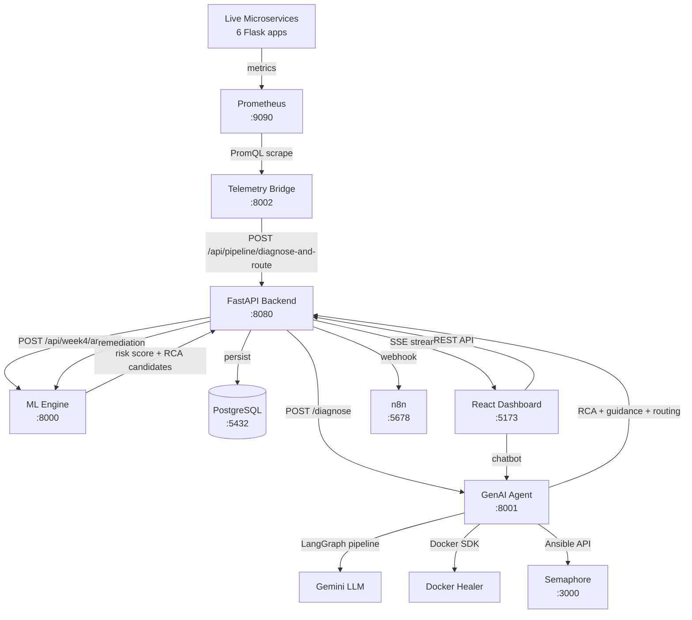

# Synapse RiskOps — Comprehensive Product Analysis

---

# 1. Executive Summary

Synapse RiskOps is an **AI-powered autonomous incident intelligence platform** for microservice infrastructure. It combines real-time anomaly detection (Isolation Forest), failure prediction (Statsmodels), dependency graph analysis (NetworkX), LLM-powered root cause analysis (Gemini via LangGraph), confidence-based autonomy routing, and automated remediation — all unified into a React dashboard with real-time SSE streaming.

**What exists today is genuinely impressive for an academic capstone.** The system implements a complete end-to-end pipeline from telemetry ingestion → ML risk scoring → GenAI root cause analysis → confidence routing → automated remediation → incident persistence → real-time dashboard. This is not a trivial monitoring dashboard — it is a working prototype of a multi-agent AIOps platform.

**However, critical gaps remain** between the current implementation and a platform a real SRE team would rely on daily. The most impactful missing capabilities are: incident ownership & collaboration workflows, historical pattern intelligence, real-time metric visualization with time-range controls, AI explainability evidence, and reliability analytics (MTTR/MTTD computed from actual data rather than hardcoded).

---

# 2. What Synapse RiskOps Is Today

## Implemented Components (Verified Against Code)

| Component | Status | Maturity |
|---|---|---|
| **FastAPI Backend** (port 8080) | ✅ Implemented | Production-like |
| **PostgreSQL** with full schema (users, services, incidents, incident_history, risk_assessments, service_dependencies) | ✅ Implemented | Production-like |
| **JWT Authentication** with RBAC (ADMIN, SRE, ENGINEER) | ✅ Implemented | Production-like |
| **Incident CRUD API** with audit trail | ✅ Implemented | Production-like |
| **SSE Real-time streaming** to dashboard | ✅ Implemented | Production-like |
| **Isolation Forest anomaly detector** with P1-A dynamic rescaling + P1-B guardrails | ✅ Implemented | Solid prototype |
| **Statsmodels failure forecaster** with velocity/acceleration analysis | ✅ Implemented | Solid prototype |
| **Composite Risk Engine** (weighted anomaly + forecast + topology cascade) | ✅ Implemented | Solid prototype |
| **NetworkX dependency graph** with PageRank, centrality, cascade simulation, root cause ranking | ✅ Implemented | Solid prototype |
| **LangGraph RCA pipeline** (5-node: ML → LogAnalyzer → RootCauseIdentifier → GuidanceGenerator → ConfidenceRouter → Remediation) | ✅ Implemented | Prototype |
| **Gemini LLM** for root cause identification + proactive guidance | ✅ Implemented | Prototype |
| **Confidence Router** (auto_remediate vs escalate thresholds) | ✅ Implemented | Prototype |
| **Orchestrator** (end-to-end lifecycle: deduplication, debouncing, recovery detection) | ✅ Implemented | Production-like |
| **Runbook Engine** (YAML definitions, Docker/Ansible/K8s executors) | ✅ Implemented | Prototype |
| **Docker Healer** (container restart/scale remediation) | ✅ Implemented | Prototype |
| **Ansible Executor** (Semaphore integration) | ✅ Implemented | Prototype |
| **n8n webhook dispatch** | ✅ Implemented | Prototype |
| **Telemetry Bridge** (Prometheus → ML Engine) | ✅ Implemented | Prototype |
| **Live microservices** (6 Flask services + traffic generator) | ✅ Implemented | Demo |
| **React Dashboard** (Command Center, Topology, Incidents, RCA, Remediation, Services, Risk History) | ✅ Implemented | Solid prototype |
| **AI Chatbot** (ReAct agent + deterministic fallback) | ✅ Implemented | Prototype |
| **Prometheus + Alertmanager + OTel Collector + Jaeger + cAdvisor** | ✅ Configured | Infrastructure |

## Partially Implemented / Placeholder

| Component | Status |
|---|---|
| `evaluation/backtest.py` | Placeholder (14 lines, docstring only) |
| `evaluation/metrics.py` | Placeholder (docstring only) |
| Activepieces workflows | Configured in docker-compose but no actual workflows defined |
| Kubernetes healer (`k8s_healer.py`) | Code exists but requires K8s cluster |

---

# 3. Problem It Solves

## Current Problem Addressed

Synapse RiskOps addresses the **incident response lifecycle fragmentation** problem in microservice architectures:

| Problem | Does Current Implementation Address It? |
|---|---|
| Detecting abnormal service behavior | ✅ Yes — Isolation Forest + guardrails |
| Predicting failures before they happen | ✅ Yes — Statsmodels forecaster with failure horizons |
| Understanding service dependencies | ✅ Yes — NetworkX graph with blast radius |
| Identifying root cause (not just symptoms) | ✅ Yes — Graph-aware RCA + Gemini LLM |
| Correlating multiple telemetry signals | ✅ Partially — composite risk score combines anomaly + forecast |
| Deciding when automation is safe | ✅ Yes — Confidence router with dual thresholds |
| Providing remediation guidance | ✅ Yes — Proactive guidance generator + runbooks |
| Reducing MTTR | ⚠️ Partially — orchestrator automates creation-to-resolution, but MTTR is hardcoded in UI |
| Maintaining incident history | ✅ Yes — Full audit trail in PostgreSQL |
| Understanding cascading failures | ✅ Yes — Cascade simulation with depth-based timeline |
| Reducing alert fatigue | ⚠️ Partially — Deduplication/debouncing exists, but no alert grouping or suppression |
| Monitoring overload | ⚠️ Partially — Single dashboard, but no personalization or priority filtering |

## User Problem (Without Synapse RiskOps)

```
Monitor Grafana/Datadog dashboards
→ Notice abnormal metric (manual)
→ Check other metrics to confirm (manual)
→ Investigate logs across services (manual)
→ Trace service dependencies (manual, from docs/memory)
→ Determine root cause vs symptom (experience-based)
→ Assess blast radius (mental model)
→ Decide severity (subjective)
→ Determine remediation (runbook lookup)
→ Get approval (Slack/PagerDuty)
→ Execute remediation (kubectl/ansible)
→ Verify recovery (back to dashboards)
→ Document incident (Confluence/Jira)
```
**Average time: 30-60+ minutes. Entirely human-driven.**

## User Problem (With Synapse RiskOps)

```
Telemetry Bridge scrapes Prometheus (automatic)
→ ML Engine detects anomaly + predicts failure (automatic, ~seconds)
→ Dependency graph traces propagation path (automatic)
→ GenAI identifies root cause with evidence (automatic, ~2-5s)
→ Confidence router decides: auto-remediate or escalate (automatic)
→ Incident created with full context in PostgreSQL (automatic)
→ SSE pushes real-time alert to dashboard (automatic)
→ n8n webhook triggers notification (automatic)
→ SRE sees incident with RCA, guidance, blast radius (< 30 seconds)
→ SRE approves remediation or system auto-remediates (1-click)
→ Recovery detected automatically, incident resolved (automatic)
```
**Average time: 2-5 minutes. Mostly autonomous with human oversight.**

---

# 4. Target Users

## Primary Users

### 1. Site Reliability Engineer (SRE)
- **Cares about**: Service availability, incident resolution, SLO compliance
- **Needs**: Real-time alerts, root cause context, remediation actions, blast radius
- **Current support**: ✅ Command Center dashboard, incident feed, RCA panel, remediation execution
- **Missing**: MTTR/MTTD analytics from real data, SLO tracking, on-call assignment, incident ownership

### 2. DevOps Engineer
- **Cares about**: Deployment stability, infrastructure health, automation reliability
- **Needs**: Service topology, dependency health, deployment correlation
- **Current support**: ✅ Topology map, service catalog, runbook execution
- **Missing**: Deployment/change correlation, infrastructure metric trends, runbook success rates

### 3. Incident Responder (On-Call)
- **Cares about**: Fast triage, actionable context, safe remediation
- **Needs**: "What is failing, why, what to do, is it safe to act?"
- **Current support**: ✅ Incident timeline, AI guidance, confidence routing
- **Missing**: Incident acknowledgement, assignment, notes, escalation workflow, similar past incidents

### 4. Engineering Manager
- **Cares about**: Reliability trends, team workload, recurring issues
- **Needs**: MTTR trends, incident frequency, service reliability scores
- **Current support**: ⚠️ Risk history view exists but lacks aggregate analytics
- **Missing**: Reliability dashboard, team performance metrics, recurring failure detection

## Secondary Users

### 5. Platform Engineer
- **Cares about**: Infrastructure capacity, dependency bottlenecks
- **Current support**: ✅ Topology with PageRank/centrality analysis
- **Missing**: Capacity planning, resource utilization trends

---

# 5. Current Architecture

## Verified Data Flow



## Component Details

| Component | Purpose | Input | Output | Maturity |
|---|---|---|---|---|
| **Live Services** | Generate real telemetry | HTTP traffic | Prometheus metrics | Demo |
| **Prometheus** | Metric collection & storage | Scrape targets | PromQL queries | Production-like |
| **Telemetry Bridge** | Normalize Prom metrics → ML schema | PromQL results | ServiceMetricsInput | Prototype |
| **ML Engine** | Anomaly detection + forecasting + graph RCA | Service metrics | Risk score, candidates, runbook | Solid prototype |
| **GenAI Agent** | LLM-powered RCA + guidance | Metrics + logs | Root causes, guidance, routing | Prototype |
| **Backend** | Orchestration, persistence, auth, SSE | Pipeline requests | Unified incident records | Production-like |
| **PostgreSQL** | Persistent storage | ORM operations | Query results | Production-like |
| **React Dashboard** | Visualization & interaction | API/SSE data | UI | Solid prototype |
| **n8n** | External notifications/automation | Webhook payload | Slack/email/actions | Configured |
| **Runbook Engine** | YAML-driven remediation execution | Failure type + service | Step results | Prototype |

## Architectural Strengths
- Clean microservice separation (Backend, ML Engine, GenAI Agent)
- Async orchestration with httpx
- Incident deduplication/debouncing in orchestrator
- Automatic recovery detection
- Full audit trail in PostgreSQL
- SSE for real-time dashboard updates
- Graceful fallbacks when services are unavailable

## Architectural Gaps
- No message queue between services (direct HTTP calls)
- No circuit breaker pattern between services
- Telemetry Bridge polling interval is fixed (30s)
- No metric retention/storage beyond Prometheus's 15d
- No WebSocket for chatbot (uses polling)
- No caching layer for repeated ML queries

---

# 6. Current Features

## Verified Feature Inventory

### Backend Features
- [x] JWT authentication with role-based access (ADMIN, SRE, ENGINEER)
- [x] User registration and login
- [x] Incident CRUD (create, list, get, update, delete)
- [x] Incident status transitions with audit history
- [x] Service catalog (list, get, topology)
- [x] Risk assessment persistence and querying
- [x] SSE real-time streaming (connected, ping, incident_created, incident_updated, risk_alert)
- [x] Pipeline orchestration endpoint (diagnose-and-route)
- [x] Remediation execution endpoint
- [x] Alert injection endpoint
- [x] n8n webhook dispatch (incident + recovery)

### ML Engine Features
- [x] Isolation Forest anomaly detection with dynamic rescaling
- [x] P1-B univariate z-score guardrails
- [x] Feature contribution ranking
- [x] Statsmodels Exponential Smoothing failure forecasting
- [x] Composite risk scoring (anomaly 60% + forecast 40%; shifted to 85/15 during anomaly)
- [x] Topology-aware cascade risk propagation
- [x] NetworkX dependency graph (PageRank, betweenness centrality)
- [x] Blast radius calculation
- [x] Root cause candidate ranking (criticality × type × distance)
- [x] Cascade failure simulation
- [x] Common root cause identification for multiple alerting services
- [x] Runbook matching and execution endpoint
- [x] Batch scoring
- [x] Model evaluation (accuracy, precision, recall, F1)

### GenAI Agent Features
- [x] LangGraph 5-node state graph pipeline
- [x] Gemini-powered root cause identification
- [x] Proactive guidance generation
- [x] Confidence router (ML conf ≥ 0.85 AND RCA conf ≥ 0.80)
- [x] Remediation node (Docker healer → runbook engine fallback)
- [x] ReAct chatbot agent with 6 tools
- [x] Deterministic chatbot fallback engine
- [x] Session management for multi-turn conversations

### Dashboard Features
- [x] Landing page → Auth → Onboarding → Dashboard flow
- [x] Command Center (unified KPIs + topology + risk + incidents + guidance)
- [x] Dependency Graph View (React Flow interactive visualization)
- [x] Risk Score Panel (real-time risk bars per service)
- [x] Incident Timeline (chronological feed with status/severity badges)
- [x] AI Guidance Panel (root cause hypothesis, confidence, remediation execution)
- [x] Incidents & Audit Management (full CRUD, history, search, filters)
- [x] Root Cause Analysis View (dedicated RCA interface)
- [x] Remediation View (runbook catalog, execution history)
- [x] Services Catalog View (service inventory with criticality)
- [x] Risk History View (historical risk assessment log)
- [x] Simulate Alert Modal (scenario injection)
- [x] AI Chatbot Widget (floating chat panel)
- [x] Dark/Light theme toggle
- [x] RBAC-gated remediation actions (SRE/ADMIN only)
- [x] Collapsible sidebar navigation

---

# 7. Current UI/UX Analysis

## Screens Overview

| Screen | Purpose | Quality |
|---|---|---|
| Landing Page | Product introduction | ✅ Well-designed |
| Auth Screen | Login/register | ✅ Functional |
| Onboarding Wizard | Initial setup | ✅ Good UX |
| Command Center | Unified operations view | ✅ Strong layout |
| Topology Map | Dependency visualization | ✅ Interactive React Flow |
| Incidents & Audit | Incident management | ✅ Full CRUD + filters |
| Risk Analytics | Risk score visualization | ✅ Per-service bars |
| RCA View | Root cause analysis | ✅ Dedicated interface |
| Remediation | Runbook execution | ✅ Execution tracking |
| Services Catalog | Service inventory | ✅ Clean catalog |
| Risk History | Historical assessments | ✅ Chronological log |

## User Experience by Scenario

### A. Normal Healthy Operation
**Current**: KPI strip shows green indicators, 0 active incidents, 99.9% system health.
**Strength**: Clean, calm dashboard that doesn't distract.
**Gap**: No proactive insights ("your most fragile services are...", "trending toward risk...").

### B. Warning/Degraded State
**Current**: KPI badges turn amber/red, incident appears in timeline, risk bars update.
**Strength**: Visual severity badges and real-time SSE updates.
**Gap**: No transition animation showing *when* degradation started. No "compare to 1 hour ago."

### C. Critical Incident
**Current**: Incident created automatically, appears in feed, guidance panel shows RCA.
**Strength**: AI-generated root cause + confidence + affected services.
**Gap**: No audio/visual alarm. No "this is impacting X users." No incident ownership.

### D. Active Investigation
**Current**: User clicks incident → sees root cause, guidance, affected services.
**Strength**: Drill-down from incident to guidance to topology.
**Gap**: No linked metric charts. No "what changed before this?" No similar past incidents.

### E. Remediation
**Current**: SRE clicks "Execute Remediation" → action runs → incident resolves.
**Strength**: RBAC-gated, audit-trailed remediation with SSE broadcast.
**Gap**: No step-by-step execution progress. No rollback option. No "did it actually fix it?"

### F. Recovery
**Current**: Orchestrator detects risk drop, auto-resolves incident, broadcasts recovery.
**Strength**: Automatic recovery detection is genuinely useful.
**Gap**: No recovery verification (re-check metrics after N minutes). No "recovery confidence."

### G. Post-Incident Analysis
**Current**: Incident history shows audit trail of status changes.
**Gap**: No incident timeline visualization. No MTTR calculation from actual timestamps. No postmortem template.

## UX Strengths
1. **Clean information hierarchy** — KPIs → topology → incidents → guidance
2. **Real-time SSE streaming** — genuine live updates
3. **RBAC-gated actions** — SRE-appropriate access control
4. **Interactive topology** — React Flow with node selection linked to incidents
5. **Smooth transitions** — CSS animation staggering on card entry
6. **AI chatbot** — conversational interface for quick queries

## UX Weaknesses
1. **Hardcoded KPIs** — MTTR "2m 14s" and System Health percentages are static, not computed from data
2. **No time-range selection** — Cannot view "last 1 hour" vs "last 24 hours"
3. **No metric charts** — No CPU/memory/latency time-series graphs
4. **No incident ownership** — Cannot acknowledge, assign, or add notes
5. **Missing "what changed?"** — No deployment/change correlation
6. **No similar incident matching** — Cannot find "has this happened before?"
7. **Weak recovery visibility** — No post-remediation verification
8. **No notification preferences** — All or nothing
9. **No global search** — Cannot search across incidents, services, RCA
10. **No breadcrumb navigation** — Incident → RCA → Remediation journey is disjointed

---

# 8. Current User Journey

```
LANDING PAGE
    ↓
AUTH (Login/Register)
    ↓
ONBOARDING WIZARD
    ↓
COMMAND CENTER
├── View KPI strip (Active Incidents, Services, Health, MTTR)
├── View Topology Map (service dependency graph)
├── View Risk Score Panel (per-service risk bars)
├── View Incident Timeline (chronological feed)
└── View Guidance Panel (AI root cause + remediation)
    ↓
INCIDENT TRIGGERED (manual simulate or telemetry bridge)
    ↓
ORCHESTRATOR: ML → GenAI → Confidence → Persist → SSE
    ↓
DASHBOARD UPDATES (real-time)
    ↓
SRE INVESTIGATES
├── Read AI guidance
├── Check topology/blast radius
├── (Optional) Chat with AI copilot
    ↓
SRE REMEDIATES (click "Execute Remediation")
    ↓
INCIDENT RESOLVED (auto or manual)
    ↓
AUDIT TRAIL RECORDED
```

---

# 9. Major Product Gaps

| Area | Current State | Gap | User Impact | Recommended Improvement |
|---|---|---|---|---|
| **Observability** | Risk scores + dependency graph | No metric time-series charts | SRE cannot see *what* changed | Add metric visualization with time-range selector |
| **Incident Management** | CRUD + audit trail | No ownership, acknowledgement, notes, assignment | No accountability; SREs don't know who's handling what | Add incident ownership workflow |
| **Historical Intelligence** | Risk history table | No similar incident matching, no recurring failure detection | SRE reinvestigates same issues | Add past incident correlation |
| **Reliability Analytics** | Hardcoded MTTR/MTTD | No computed MTTR, MTTD, incident frequency | Manager cannot assess team performance or trends | Compute from actual incident timestamps |
| **Explainability** | GenAI text explanation | No evidence trail (which metrics triggered, feature contributions displayed) | SRE cannot verify AI reasoning | Show metric evidence alongside AI explanation |
| **Alert Intelligence** | Deduplication/debouncing | No alert grouping, suppression, or correlation | Alert fatigue during cascading failures | Group related alerts by dependency chain |
| **Change Intelligence** | None | No deployment/config change tracking | "What changed?" is unanswerable | Add change event correlation |
| **Recovery Verification** | Auto-detect risk drop | No post-remediation re-check | SRE unsure if fix actually worked | Add verification polling after remediation |
| **AI Accuracy** | backtest.py is placeholder | No ML/AI accuracy tracking | Cannot trust AI predictions | Implement and display model performance metrics |
| **User Experience** | 7 navigation views | No time-range selector, global search, or drill-down links | Slow investigation workflow | Add time controls and cross-entity navigation |
| **Persistence** | PostgreSQL for incidents | No metric history persistence beyond Prometheus 15d | Cannot do long-term trend analysis | Add metric summary persistence |
| **Security** | JWT + RBAC | No audit log for auth events, no MFA | Insufficient for production security | Add auth event logging |
| **Integrations** | n8n webhook | No PagerDuty, Slack, Jira, OpsGenie | Cannot notify through standard channels | Add standard integration adapters |

---

# 10. Recommended Features

## P0 — Must Have

### 1. Incident Ownership & Collaboration Workflow
Add: acknowledge → assign → investigate → resolve status machine. Add notes/comments per incident. Show owner in incident list.

### 2. Real Metric Visualization with Time-Range Controls
Add: CPU, memory, error_rate, latency time-series charts per service. Add time-range selector (15m, 1h, 6h, 24h, 7d). Link charts to incidents.

### 3. Computed Reliability Metrics (MTTR, MTTD, Frequency)
Replace hardcoded KPIs with actual calculations from incident timestamps. Show trends over time.

### 4. AI Explainability Evidence Panel
Show: which metrics triggered the anomaly, feature contribution scores, z-score deviations, confidence interval bands. Let SRE verify AI reasoning.

### 5. Incident-to-Metric Drill-Down Navigation
Click incident → see affected service metrics at time of incident. Click service in topology → see its risk history + incidents.

## P1 — High Value

### 6. Similar Past Incident Matching
For any active incident, find past incidents on the same service with similar failure types. Show previous root cause and resolution.

### 7. Alert Grouping & Correlation
When cascading failure hits multiple services, group related alerts into a single incident cluster rather than N separate incidents.

### 8. Post-Remediation Verification
After remediation executes, poll metrics for 5-10 minutes. Report whether the fix worked. Auto-reopen if risk re-elevates.

### 9. Change Event Timeline
Track deployment timestamps, config changes, and infrastructure events. Show "what changed before this incident?" timeline.

### 10. Recurring Failure Detection
Identify services that fail with the same pattern repeatedly. Surface "payment-service has had 4 latency incidents this week" proactively.

## P2 — Useful

### 11. Service Reliability Score
Compute per-service reliability (uptime %, incident frequency, average MTTR). Show in services catalog.

### 12. Notification Preferences
Let users choose: email, Slack, PagerDuty. Set thresholds for notification severity.

### 13. Global Search
Search across incidents, services, RCA explanations. Enable "find incident about payment-service from last week."

### 14. Dashboard Personalization
Role-based default views (SRE sees incidents first, manager sees reliability trends).

### 15. Model Accuracy Dashboard
Show anomaly detection precision/recall, RCA accuracy, routing decision correctness over time.

## P3 — Future / Advanced

### 16. Predictive Maintenance Scheduling
Based on failure patterns, recommend preventive maintenance windows.

### 17. SLO/Error Budget Tracking
Define SLOs per service, track error budget burn rate, alert before budget exhaustion.

### 18. Multi-Cluster Support
Monitor multiple environments (staging, production) from one dashboard.

### 19. Autonomous Learning
Use resolved incident outcomes to retrain ML models and adjust confidence thresholds automatically.

### 20. Runbook Auto-Generation
Use GenAI to draft new runbooks based on past remediation patterns.

---

# 11. Top 5 Features to Add

## #1: Incident Ownership & Collaboration Workflow

- **User problem**: "An incident is OPEN but nobody knows who's handling it. Two SREs might investigate the same thing, or nobody acts because they assume someone else is."
- **Why it matters**: Without ownership, incidents fall through cracks. This is the #1 difference between a dashboard and an incident management platform.
- **How it works**: Add status states: OPEN → ACKNOWLEDGED → INVESTIGATING → REMEDIATING → RESOLVED. Add `acknowledged_by`, `acknowledged_at` fields. Add incident notes/comments. Show owner avatar in incident list.
- **Builds upon**: Existing `Incident` model (add 2 columns), existing `IncidentHistory` (already tracks changes), existing `assigned_to` field.
- **User benefit**: Clear accountability. Faster response. No duplicate investigations.
- **Complexity**: Low-Medium. Schema change + API update + UI update.

## #2: Real Metric Visualization with Time-Range Controls

- **User problem**: "I see a risk score of 82, but I don't know what the actual CPU/memory/latency values are, or how they've changed over time."
- **Why it matters**: Risk scores are abstractions. SREs need raw metrics to validate AI decisions and understand severity.
- **How it works**: Add Recharts time-series panels per service. Query risk_assessments table for historical data points (already persisted with `features_used` JSONB and `assessed_at` timestamps). Add time-range selector.
- **Builds upon**: Existing `risk_assessments` table (has `features_used` JSONB with all metric values), existing Recharts dependency.
- **User benefit**: SRE can see metric trends, validate AI conclusions, spot patterns.
- **Complexity**: Medium. Frontend-heavy. Backend already stores the data.

## #3: AI Explainability Evidence Panel

- **User problem**: "The AI says payment-service is the root cause with 0.92 confidence, but I have no idea why. Should I trust this?"
- **Why it matters**: AI without explainability is useless for high-stakes decisions. SREs won't act on opaque recommendations.
- **How it works**: Display alongside AI guidance: (a) which metrics deviated (from anomaly_detail.top_contributing_features), (b) z-score deviations (from guardrail_info), (c) dependency path that led to RCA candidate, (d) confidence interval. All this data already exists in the ML engine response.
- **Builds upon**: Existing `anomaly_detail`, `guardrail_info`, `propagation_path`, `rca_candidates` — all already computed and returned by ML engine.
- **User benefit**: SRE can verify AI reasoning. Builds trust. Enables human override with evidence.
- **Complexity**: Low-Medium. Data already exists. UI rendering needed.

## #4: Computed Reliability Metrics (MTTR, MTTD, Frequency)

- **User problem**: "Dashboard says MTTR is 2m 14s but that number never changes. Is this real? How are we trending?"
- **Why it matters**: Hardcoded metrics destroy trust. Engineering managers need real trends to justify investments.
- **How it works**: Compute from `incidents` table: MTTR = avg(resolved_at - detected_at) for resolved incidents. MTTD = avg(detected_at - first_anomaly_time). Incident frequency = count per time window. Add `/api/analytics/reliability` endpoint.
- **Builds upon**: Existing `incidents` table with `detected_at`, `resolved_at`, and `created_at` timestamps.
- **User benefit**: Real data. Trend visibility. Quantified improvement from automation.
- **Complexity**: Low. SQL aggregation + simple frontend.

## #5: Similar Past Incident Matching

- **User problem**: "Payment-service is failing again with a latency spike. Has this happened before? What fixed it last time?"
- **Why it matters**: Recurring incidents are the most common type. Showing past resolution saves 50%+ investigation time.
- **How it works**: When viewing an incident, query: `SELECT * FROM incidents WHERE service_id = :svc AND predicted_failure_type = :type AND status = 'RESOLVED' ORDER BY resolved_at DESC LIMIT 5`. Show: previous root cause, guidance, resolution, MTTR.
- **Builds upon**: Existing `incidents` table (has `service_id`, `predicted_failure_type`, `root_cause`, `guidance`).
- **User benefit**: Instant context from organizational memory. Dramatically faster resolution.
- **Complexity**: Low. SQL query + UI panel.

---

# 12. Ideal Future Dashboard

## Top-Level KPIs (Always Visible)
- **Active Incidents** — count + critical badge (computed from DB)
- **System Health** — percentage of services in HEALTHY tier (computed from latest risk assessments)
- **MTTR** — rolling 7-day average (computed from incident timestamps)
- **Services Monitored** — count of active services
- *Visible immediately. Updated in real-time via SSE.*

## Current Incidents (Primary Focus)
- Active incident cards with: service, severity, owner, age, AI summary
- One-click acknowledge / assign / escalate
- *Visible immediately. Expandable for full details.*

## Service Health (Left Panel)
- Grid/list of all services with health indicator dots
- Click to drill into service detail (metrics, incidents, dependencies)
- *Visible immediately. Compact representation.*

## Risk Overview (Embedded in Service Health)
- Per-service risk scores as colored bars or sparklines
- Trend arrows (rising/falling/stable)
- *Visible as part of service health. Drill-down for history.*

## Dependency Health (Topology)
- Interactive topology map with health-colored nodes
- Click node → see service detail + blast radius
- *Available in dedicated view + minimap in command center.*

## AI/RCA Insights (Right Panel)
- For selected incident: root cause hypothesis + evidence + confidence
- Feature contribution bars
- "Similar past incidents" card
- *Available on drill-down from incident selection.*

## Automation Status
- Latest remediation execution results
- Runbook success/failure rates
- *Available in Remediation view. Summary in KPI strip.*

## Historical Reliability (Analytics)
- MTTR trend chart (7d/30d)
- Incident frequency by service
- Service reliability scores
- *Available in dedicated analytics view.*

## Recent Changes (Context)
- Latest deployments, config changes
- Correlated with incident timeline
- *Available in incident detail view. FUTURE feature.*

## Recommended Actions
- AI-recommended next steps for active incidents
- Proactive warnings for trending risks
- *Part of guidance panel and chatbot.*

---

# 13. Ideal User Journey

```
LOGIN
    ↓ JWT + RBAC
COMMAND CENTER OVERVIEW
    ↓ See KPIs: 2 active incidents, 1 critical
    ↓ See topology: payment-service node is red
    ↓ See incident feed: "Latency Degradation on payment-service"
    ↓
SELECT INCIDENT
    ↓ See AI RCA: "Root cause: postgres-primary connection pool exhaustion"
    ↓ See evidence: error_rate z-score=6.2, response_time_p99 z-score=5.8
    ↓ See confidence: 0.92 (AUTO_REMEDIATE eligible)
    ↓ See blast radius: order-service, api-gateway affected
    ↓ See similar past: "Same failure 3 days ago, resolved in 4min by scaling connections"
    ↓
ACKNOWLEDGE INCIDENT
    ↓ Status: OPEN → ACKNOWLEDGED by sre@team.com
    ↓
INVESTIGATE
    ↓ View metric charts: connection pool utilization spiking last 15 min
    ↓ View dependency path: api-gateway → order-service → payment-service → postgres-primary
    ↓ Ask chatbot: "What changed before this incident?"
    ↓
APPROVE REMEDIATION
    ↓ Review recommended action: "Scale postgres connections from 100 → 200"
    ↓ See runbook steps and rollback plan
    ↓ Click "Execute with Approval"
    ↓
REMEDIATION EXECUTES
    ↓ Step-by-step progress shown
    ↓ Audit trail recorded
    ↓
VERIFICATION
    ↓ System monitors metrics for 5 minutes
    ↓ Risk score drops from 82 → 35
    ↓ Status: REMEDIATING → RESOLVED
    ↓
POST-INCIDENT
    ↓ View timeline: detection → diagnosis → routing → remediation → recovery
    ↓ MTTR computed: 3m 42s
    ↓ Similar incidents updated for future reference
```

---

# 14. Product Value vs Demo Value

### Real Operational Value
Features that would genuinely help a real engineering team:

| Feature | Why It's Real |
|---|---|
| Isolation Forest anomaly detection + guardrails | Catches real anomalies with calibrated thresholds |
| Composite risk scoring (anomaly + forecast + cascade) | Multi-signal risk is better than single-metric alerting |
| Dependency graph with blast radius | Critical for understanding failure propagation |
| Incident deduplication/debouncing | Prevents alert spam during ongoing incidents |
| Automatic recovery detection | Reduces manual monitoring during resolution |
| Full audit trail | Accountability and post-incident review |
| Confidence-based routing | Prevents unsafe automation |
| RBAC-gated remediation | Security-appropriate access control |
| SSE real-time streaming | Genuine live dashboard updates |

### Prototype Value
Useful concepts that need maturation for production:

| Feature | What Needs Maturation |
|---|---|
| LangGraph RCA pipeline | Needs evaluation against ground truth, prompt tuning |
| Gemini root cause identification | Accuracy is unvalidated; no feedback loop |
| Runbook engine | YAML definitions exist but limited to Docker restart/scale |
| Telemetry Bridge | Fixed polling interval, no dynamic scaling |
| AI chatbot | Works but lacks deep tool integration verification |
| Statsmodels forecaster | Trained on synthetic data; needs real-world validation |

### Demo Value
Primarily useful for demonstrating the concept:

| Feature | Why It's Demo-Oriented |
|---|---|
| Live Flask microservices | Minimal services that generate synthetic-like telemetry |
| Traffic generator | Simulates load but not realistic traffic patterns |
| Hardcoded KPIs (MTTR "2m 14s", health percentages) | Not computed from actual data |
| `evaluation/backtest.py` (placeholder) | Critical validation absent |
| Activepieces integration | Configured but no actual workflows |
| Simulate Alert Modal | Useful for demos, but wouldn't exist in production |

---

# 15. Recommended Product Roadmap

## Phase 1: Foundation Trust (2-3 weeks)
*Make the existing data trustworthy and actionable.*

1. Replace hardcoded KPIs with computed reliability metrics
2. Add metric time-series visualization with time-range controls
3. Add AI explainability evidence panel
4. Add incident ownership workflow (acknowledge/assign/notes)
5. Implement backtest.py for ML accuracy validation

## Phase 2: Incident Intelligence (2-3 weeks)
*Make investigation faster and smarter.*

6. Similar past incident matching
7. Cross-entity drill-down navigation (incident ↔ service ↔ metrics ↔ RCA)
8. Alert grouping for cascading failures
9. Post-remediation verification polling
10. Global search across incidents and services

## Phase 3: Reliability Analytics (2-3 weeks)
*Enable trend analysis and continuous improvement.*

11. Service reliability scores
12. Recurring failure detection and proactive warnings
13. MTTR/MTTD trend dashboards
14. Model accuracy tracking dashboard
15. Change event timeline (deployment correlation)

## Phase 4: Enterprise Readiness (3-4 weeks)
*Scale for real team usage.*

16. Standard integrations (PagerDuty, Slack, Jira)
17. Notification preferences and escalation policies
18. Dashboard personalization by role
19. SLO/error budget tracking
20. Multi-environment support

---

# 16. Final Product Positioning

Synapse RiskOps is best positioned as an:

## **AI-Powered Incident Intelligence & Response Platform**

Not just an AIOps dashboard. Not just a monitoring tool. Not just an alerting system.

**Why this positioning:**

1. **"AI-Powered"** — The platform genuinely uses ML (Isolation Forest + Statsmodels) and GenAI (Gemini + LangGraph) for detection, prediction, and root cause analysis. This isn't AI-washing; the AI makes real decisions (risk scoring, RCA, confidence routing).

2. **"Incident Intelligence"** — The core differentiator is not *showing* metrics but *understanding* them. The platform doesn't just detect anomalies — it identifies root causes, traces dependency propagation, ranks candidates, and generates actionable guidance.

3. **"Response Platform"** — It doesn't stop at detection. It provides a complete response lifecycle: detection → diagnosis → routing → remediation → recovery → audit trail. The confidence router and runbook engine enable actual autonomous response.

**What makes it different from:**
- **Grafana/Datadog**: Those show metrics. Synapse understands them.
- **PagerDuty/OpsGenie**: Those route alerts. Synapse diagnoses and resolves them.
- **Generic AIOps**: Those promise everything. Synapse focuses on the detection → resolution lifecycle with a working implementation.

---

# 17. Final Recommendation

Synapse RiskOps has an **unusually strong technical foundation** for a capstone project. The multi-service architecture, ML pipeline, LangGraph agent, confidence-based routing, and real-time dashboard form a coherent and genuinely functional system.

**To transform it from an impressive prototype into a platform a real SRE team would adopt, the highest-priority work is:**

1. **Trust**: Replace hardcoded metrics with computed ones. Show AI evidence.
2. **Workflow**: Add incident ownership so teams can coordinate.
3. **Context**: Show metric charts so SREs can validate AI conclusions.
4. **Memory**: Surface similar past incidents to accelerate resolution.
5. **Verification**: Confirm remediation actually worked.

These 5 improvements reuse existing data and architecture while dramatically increasing the platform's practical value. None require fundamentally new infrastructure — they build directly on what's already implemented.

> **Bottom line:** Synapse RiskOps is not "just another dashboard." It's a working prototype of what the next generation of incident response platforms looks like — where ML detects, GenAI diagnoses, automation resolves, and humans oversee. The gap between prototype and product is smaller than it appears.

---

# Appendix: Feature Prioritization Matrix

| Feature | User Problem | User Benefit | Technical Complexity | Priority | Why |
|---|---|---|---|---|---|
| Incident ownership workflow | Nobody knows who's handling incidents | Clear accountability, no duplicate work | Low-Medium | P0 | Fundamental to team operations |
| Metric visualization + time-range | Cannot see actual metric values or trends | Validate AI, understand severity | Medium | P0 | SREs need raw data access |
| Computed MTTR/MTTD/frequency | Hardcoded KPIs destroy trust | Real performance measurement | Low | P0 | Trust in platform data |
| AI explainability evidence | Cannot verify AI reasoning | Trust AI decisions, enable override | Low-Medium | P0 | Critical for adoption |
| Incident-to-metric drill-down | Investigation requires manual context switching | Faster investigation workflow | Medium | P0 | Core UX improvement |
| Similar past incidents | Reinvestigating known problems | Instant historical context, faster MTTR | Low | P1 | Leverages existing data |
| Alert grouping/correlation | N alerts for 1 cascading failure | Reduced alert fatigue | Medium | P1 | Directly addresses alert noise |
| Post-remediation verification | Unsure if fix worked | Confidence in resolution | Medium | P1 | Completes remediation loop |
| Change event timeline | "What changed?" unanswerable | Correlate incidents with deployments | Medium-High | P1 | Requires new data source |
| Recurring failure detection | Same failures repeat unnoticed | Proactive problem identification | Low-Medium | P1 | SQL pattern detection |
| Service reliability score | No per-service health summary | Quick health assessment | Low | P2 | Aggregation of existing data |
| Global search | Cannot find past incidents quickly | Faster information retrieval | Medium | P2 | UX improvement |
| Notification preferences | All-or-nothing alerting | Personalized notification | Medium | P2 | User preference management |
| Model accuracy dashboard | Cannot assess AI trustworthiness | Quantified AI performance | Medium | P2 | Requires ground truth labeling |
| SLO/error budget tracking | No SLA visibility | Proactive reliability management | Medium-High | P3 | New domain concept |
| Predictive maintenance scheduling | Reactive-only approach | Prevent incidents before they happen | High | P3 | Advanced ML required |
| Autonomous learning/retraining | Static ML models | Continuously improving predictions | High | P3 | ML ops pipeline needed |
